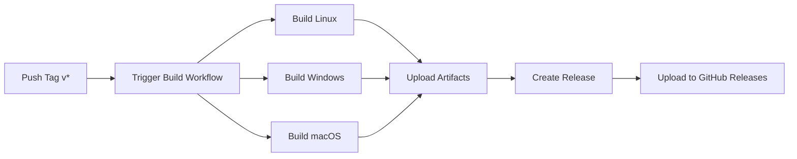

# Quick Start - CI/CD Pipeline

Getting started with automated builds and releases for InkBridge PC Companion.

## 🚀 Quick Release Guide

### Prerequisites
- Repository forked/cloned on GitHub
- Push access to the repository

### Create a New Release in 3 Steps

1. **Bump Version**
   ```bash
   npm version patch  # 1.0.0 → 1.0.1
   # or
   npm version minor  # 1.0.0 → 1.1.0
   # or
   npm version major  # 1.0.0 → 2.0.0
   ```

2. **Update CHANGELOG.md**
   ```bash
   # Move items from [Unreleased] to new version section
   vim CHANGELOG.md
   git add CHANGELOG.md
   git commit -m "docs: update changelog for v1.0.1"
   ```

3. **Push Tag**
   ```bash
   git push
   git push --tags
   ```

**That's it!** 🎉

GitHub Actions will automatically:
- ✅ Build for Windows, macOS, and Linux
- ✅ Create executable installers  
- ✅ Create GitHub Release
- ✅ Upload all artifacts

Check progress at: `https://github.com/YOUR_USERNAME/pc-companion/actions`

## 📦 What You Get

After ~15-20 minutes, your release will include:

### Linux
- `InkBridge-PC-Companion-1.0.1.AppImage` - Portable, works on all distros
- `inkbridge-pc-companion_1.0.1_amd64.deb` - Debian/Ubuntu installer

### Windows
- `InkBridge-PC-Companion-Setup-1.0.1.exe` - Full installer with shortcuts
- `InkBridge-PC-Companion-1.0.1.exe` - Portable executable

### macOS
- `InkBridge-PC-Companion-1.0.1.dmg` - Disk image
- `InkBridge-PC-Companion-1.0.1-mac.zip` - Archived app

## 🧪 Testing Before Release

### Option 1: Run Workflow Manually

1. Go to Actions tab
2. Select "Build and Release"
3. Click "Run workflow"
4. Choose branch
5. Click "Run workflow"

This creates artifacts without making a release.

### Option 2: Pull Request

1. Create a feature branch
2. Make changes
3. Open Pull Request
4. Workflow runs automatically
5. Check artifacts in the workflow run

### Option 3: Local Build

```bash
# Test locally before pushing
./build.sh linux    # On Linux
./build.sh windows  # On Windows
./build.sh mac      # On macOS
```

## 🔍 Monitoring Builds

### Check Build Status

**Via Badges (in README):**
- Green ✅ = All builds passing
- Red ❌ = Build failed or Yellow ⚠️ = In progress

**Via Actions Tab:**
1. Go to repository
2. Click "Actions" tab
3. See all workflow runs
4. Click on any run for details

### Get Notified

**Email Notifications:**
- Go to repository Settings
- Notifications → Actions
- Configure your preferences

**Slack/Discord Webhooks:**
Add to workflow:
```yaml
- name: Notify
  uses: 8398a7/action-slack@v3
  with:
    status: ${{ job.status }}
    webhook_url: ${{ secrets.SLACK_WEBHOOK }}
```

## 🐛 Troubleshooting

### Build Failed?

1. **Click on failed job** in Actions tab
2. **Expand failed step** to see error
3. **Common fixes:**

   **"npm install failed"**
   ```bash
   # Locally: Clear cache and try again
   rm -rf node_modules package-lock.json
   npm install
   git add package-lock.json
   git commit -m "fix: update package-lock"
   git push
   ```

   **"Build failed on macOS"**
   ```bash
   # Check electron-builder config
   # Ensure icon.icns exists in build/ folder
   ```

   **"Permission denied"**
   ```bash
   # Make scripts executable
   chmod +x build.sh install.sh
   git add build.sh install.sh
   git commit -m "fix: make scripts executable"
   git push
   ```

### Release Not Created?

Check:
- [ ] Tag starts with `v` (e.g., `v1.0.1`)
- [ ] All builds completed successfully
- [ ] No errors in "Create Release" step
- [ ] You have write permissions to repository

## 📊 Workflow Overview



## ⚙️ Advanced Usage

### Custom Build Targets

Edit `.github/workflows/build.yml`:

```yaml
strategy:
  matrix:
    os: [ubuntu-latest, windows-latest, macos-latest]
    # Add more:
    arch: [x64, arm64]
```

### Add Deploy Step

```yaml
- name: Deploy to S3
  run: |
    aws s3 sync dist/ s3://my-bucket/releases/${{ github.ref_name }}/
  env:
    AWS_ACCESS_KEY_ID: ${{ secrets.AWS_KEY }}
    AWS_SECRET_ACCESS_KEY: ${{ secrets.AWS_SECRET }}
```

### Enable Code Signing

1. **Get certificates** (Apple Developer, Windows Code Signing)
2. **Add secrets** to GitHub:
   - `CSC_LINK` - macOS cert (base64)
   - `CSC_KEY_PASSWORD` - macOS password
   - `WIN_CSC_LINK` - Windows cert
   - `WIN_CSC_KEY_PASSWORD` - Windows password

3. **Secrets are automatically used** by electron-builder

## 📚 Further Reading

- [Full CI/CD Documentation](.github/README.md)
- [GitHub Actions Docs](https://docs.github.com/actions)
- [electron-builder Multi-Platform](https://www.electron.build/multi-platform-build)

## 💡 Tips

1. **Test locally first** - Always build locally before tagging
2. **Semantic versioning** - Use meaningful version numbers
3. **Descriptive tags** - `git tag -a v1.0.1 -m "Fix connection timeout"`
4. **Update changelog** - Keep users informed of changes
5. **Monitor builds** - Check Actions tab after pushing tags

## 🆘 Need Help?

- **CI/CD Issues**: [Open issue with `ci` label](https://github.com/lsalihi/pc-companion/issues/new?labels=ci)
- **Build Problems**: Include workflow run link in issue
- **Questions**: Check [Discussions](https://github.com/lsalihi/pc-companion/discussions)

---

**Happy Releasing! 🚀**
